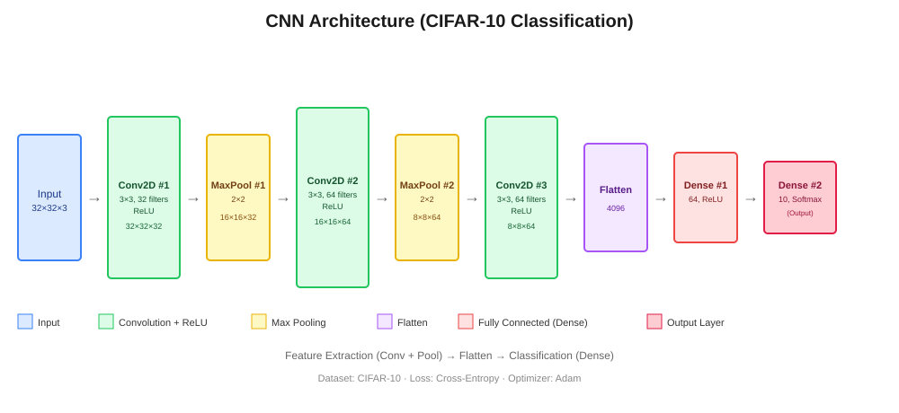

# CNN Multi-Framework: NumPy → PyTorch → Keras → ONNX → API

동일한 CNN 이미지 분류 모델을 NumPy(밑바닥 구현), PyTorch, Keras(TensorFlow) 세 가지 방식으로 각각 구현하고, ONNX로 변환하여 프레임워크 간 상호운용성을 검증한 뒤, Flask와 FastAPI로 각각 서빙 API까지 구축한 프로젝트입니다.

## 프로젝트 목적

- 프레임워크 뒤에서 일어나는 연산(forward/backward propagation)을 직접 구현해보며 원리 이해
- 동일 아키텍처를 여러 프레임워크로 구현해보며 각 프레임워크의 코드 스타일과 특징 비교
- ONNX를 통한 프레임워크 간 모델 변환 및 배포 실습
- 학습한 모델을 실제 API 서버로 서빙하는 경험 (Flask vs FastAPI 비교)

## Model Architecture

| Layer | Type | Output Shape | Parameters |
|---|---|---|---|
| Input | - | 32×32×3 | - |
| Conv2D_1 | Conv 3×3, 32 filters, ReLU | 32×32×32 | 896 |
| MaxPool_1 | 2×2 | 16×16×32 | 0 |
| Conv2D_2 | Conv 3×3, 64 filters, ReLU | 16×16×64 | 18,496 |
| MaxPool_2 | 2×2 | 8×8×64 | 0 |
| Conv2D_3 | Conv 3×3, 64 filters, ReLU | 8×8×64 | 36,928 |
| Flatten | - | 4096 | 0 |
| Dense_1 | 64 units, ReLU | 64 | 262,208 |
| Dense_2 (Output) | 10 units, Softmax | 10 | 650 |

**Total: 319,178 parameters** (PyTorch/Keras 구현 기준. NumPy 버전은 연산 속도 문제로 필터 수를 축소한 경량 버전을 사용함 — `numpy_cifar10_train.py` 참고)

Dataset: CIFAR-10 · Loss: Cross-Entropy · Optimizer: Adam (lr=0.001)



## Repository Structure

```
cnn-multi-framework/
├── README.md
├── cnn_architecture.svg
├── numpy_cnn_layers.py          # NumPy Conv2D/MaxPool/Dense forward-backward 구현
├── numpy_cifar10_train.py       # NumPy 모델로 CIFAR-10 학습
├── pytorch_cnn_train.py         # PyTorch 구현 + 학습
├── keras_cnn_train.py           # Keras 구현 + 학습 (fit / GradientTape 둘 다)
├── onnx_convert_compare.py      # PyTorch → ONNX 변환 + 출력/속도 비교
├── api/
│   ├── model_loader.py          # ONNX 모델 로딩 + 추론 공통 유틸
│   ├── main_fastapi.py          # FastAPI 서빙
│   ├── main_flask.py            # Flask 서빙
│   └── requirements.txt
└── results/
    ├── comparison_table.png     # (직접 채워 넣을 실험 결과)
    └── training_curves.png
```

## How to Run

### 1. 모델 학습 (Colab 권장 — GPU 무료 사용)

```bash
# 순서대로 실행
numpy_cnn_layers.py      → numpy_cifar10_train.py
pytorch_cnn_train.py     # cnn_pytorch.pth 저장됨
keras_cnn_train.py       # cnn_keras.keras 저장됨
onnx_convert_compare.py  # cnn_model.onnx 저장됨
```

### 2. API 서버 실행

```bash
cd api
pip install -r requirements.txt

# FastAPI
uvicorn main_fastapi:app --reload --port 8000
# http://localhost:8000/docs 에서 자동 생성된 문서 확인 가능

# Flask
python main_flask.py
# http://localhost:5000
```

### 3. 예측 요청 예시

```bash
curl -X POST -F "file=@sample.jpg" http://localhost:8000/predict
```

## Framework Comparison (실측 결과)

| 항목 | NumPy | PyTorch | Keras |
|---|---|---|---|
| 학습 데이터 규모 | 1,000장 서브셋 (5 epoch) | 전체 50,000장 (10 epoch) | 전체 50,000장 (10 epoch) |
| 학습 시간 | 약 160초 (CPU) | 116.6초 (GPU) | 48.3초 (GPU) |
| 최종 Train Accuracy | 24.5% | 81.37% | 85.60% |
| 최종 Val Accuracy | 22.4% | 72.91% (피크 73.63%, 9epoch) | 73.44% (피크 74.49%, 8epoch) |
| 코드 라인 수 (레이어+학습) | 291 + 199 = 490줄 | 172줄 | 150줄 |
| 체감 난이도 | 높음 (직접 backprop 구현) | 중간 | 낮음 |

> NumPy는 반복문 기반 구현이라 데이터 규모를 줄여 학습했습니다. 따라서 정확도 수치를 PyTorch/Keras와 직접 비교하는 것은 적절하지 않고, "구현 방식에 따른 코드량·난이도 차이"와 "원리 검증"이 이 파트의 목적입니다.
>
> PyTorch·Keras 모두 8~9 epoch 이후 train/val accuracy 격차가 벌어지는 과적합 조짐이 관찰되었습니다.

| 항목 | PyTorch (원본) | ONNX Runtime |
|---|---|---|
| 추론 속도 (batch=32, 50회 평균) | 18.22 ms/batch | 5.06 ms/batch (**3.6배 빠름**) |
| 출력값 차이 (max diff) | - | 1.53e-05 (사실상 동일) |

| 항목 | Flask | FastAPI |
|---|---|---|
| 코드 라인 수 (main 파일 기준) | 55줄 | 51줄 |
| 자동 API 문서화 | ✗ (수동/별도 라이브러리 필요) | ✓ (`/docs` 자동 생성) |
| 비동기 처리 | 제한적 | 네이티브 지원 (`async def`) |
| 응답 속도 (동일 이미지, 1회 요청) | **32.13 ms** | 52.14 ms |
| 예측 결과 일치 여부 | `frog`, confidence 0.6426 | `frog`, confidence 0.6426 (완전 일치) |

> 응답 속도는 각 1회 요청 기준이라 참고용입니다. 서버 시작 직후 상태, 캐싱 여부 등에 따라 흔들릴 수 있어 엄밀한 비교를 위해서는 여러 번 반복 요청 후 평균을 내는 것이 더 정확합니다.
> 두 프레임워크 모두 동일한 ONNX 모델을 그대로 불러와 추론하므로, 예측 결과가 완전히 동일하게 나온 것은 "서빙 프레임워크가 달라도 모델의 예측 자체는 변하지 않는다"는 것을 실제로 확인해 준 부분입니다.

## 배운 점

- NumPy로 Conv2D backward를 직접 구현하면서, "뒤집힌 필터로 다시 convolution하는 것"과 수학적으로 동치라는 걸 체감함
- PyTorch/Keras가 왜 GPU와 벡터화 연산으로 빠른지, 순수 반복문 구현과 비교하며 체감
- ONNX 변환 후에도 출력값이 거의 동일하게 유지됨 → 프레임워크 간 모델 이식이 실용적으로 가능함을 확인
- Flask와 FastAPI는 같은 기능도 비동기 처리/자동 문서화/타입 검증에서 코드 작성 경험이 꽤 다름

## Requirements

```
numpy
torch
torchvision
tensorflow
onnx
onnxruntime
fastapi
uvicorn
flask
pillow
```
